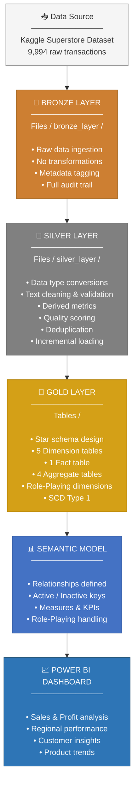
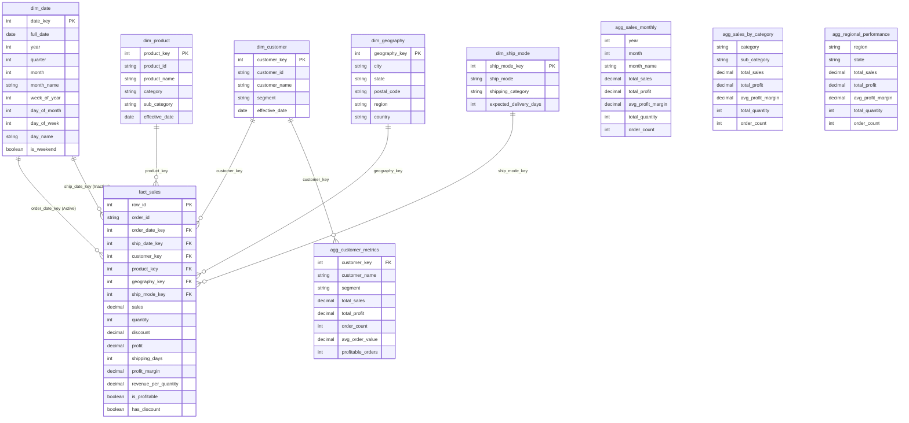

# Superstore Dataset Microsoft Fabric Analytics Pipeline


> An end-to-end data engineering pipeline built in Microsoft Fabric, implementing medallion architecture (Bronze, Silver, Gold) with incremental loading, a star schema with role-playing dimensions, and a Power BI management dashboard.

---

## Table of Contents

1. [Project Overview](#1-project-overview)
2. [Architecture Overview](#2-architecture-overview)
3. [Technology Stack](#3-technology-stack)
4. [Project Structure](#4-project-structure)
5. [Data Source](#5-data-source)
6. [Bronze Layer](#6-bronze-layer)
7. [Silver Layer](#7-silver-layer)
8. [Gold Layer — Star Schema](#8-gold-layer--star-schema)
9. [Incremental Loading Strategy](#9-incremental-loading-strategy)
10. [Data Quality](#10-data-quality)
11. [Semantic Model & Dashboard](#11-semantic-model--dashboard)
12. [Pipeline Orchestration](#12-pipeline-orchestration)
13. [Prerequisites & Setup](#13-prerequisites--setup)
14. [Future Improvements](#14-future-improvements)
15. [Author](#15-author)

---

## 1. Project Overview

### Purpose

The Superstore Analytics Pipeline is a production-ready data engineering project that transforms raw retail transaction data into actionable business insights. It demonstrates end-to-end data engineering practices using Microsoft Fabric, from raw ingestion through to a live Power BI management dashboard.

### Business Context

Retail businesses require a reliable, automated system to monitor sales performance, customer behavior, product trends, and regional performance on a daily basis. This pipeline automates the full journey from raw data to business-ready insights, reducing manual effort and enabling data-driven decision-making.

### Objectives

- Design and implement a scalable medallion architecture within a single lakehouse
- Deliver incremental loading across all layers to minimize compute costs and processing time
- Build a normalized star schema optimized for business intelligence queries
- Produce a management dashboard providing real-time visibility into retail performance

---

## 2. Architecture Overview

### Medallion Architecture

The project follows the industry-standard medallion architecture, organizing data into three logical layers — Bronze, Silver, and Gold — within a single lakehouse. Each layer refines the data progressively, from raw ingestion to business-ready analytics.



### Single Lakehouse Design

All three layers reside in one lakehouse named `superstore_project`. This approach was chosen for the following reasons:

- **Simplicity:** A single lakehouse reduces infrastructure complexity and simplifies permission management across layers.
- **Fabric Best Practice:** Aligns with Microsoft Fabric's OneLake philosophy, where logical separation does not require physical separation.
- **Scalability:** The structure can be extended to multiple lakehouses if stricter data governance or multi-domain requirements arise in the future.

The layers are physically separated through their storage location — Bronze and Silver live in `Files/` as Delta-formatted data files, while Gold layer tables are stored as managed Delta tables in `Tables/`, which enables fast DirectQuery access from Power BI.

---

## 3. Technology Stack

| Technology | Role in Project |
|---|---|
| **Microsoft Fabric** | Unified cloud analytics platform hosting the entire pipeline |
| **PySpark** | Distributed data processing engine for all transformations |
| **Delta Lake** | Storage format providing ACID transactions, schema enforcement, and time travel |
| **Power BI** | Business intelligence tool for semantic model and dashboard delivery |
| **Kaggle** | Source of the public Superstore retail dataset |

---

## 4. Project Structure

```
superstore_project/                          ← Single Lakehouse
│
├── Files/                                   ← Bronze & Silver (Delta files)
│   │
│   ├── bronze_layer/
│   │   └── raw_data/                        ← Raw ingested data from Kaggle
│   │
│   └── silver_layer/
│       ├── cleaned_data/                    ← Transformed & validated data
│       └── watermarks/                      ← Incremental load tracking
│           ├── silver_watermark/            ← Silver layer watermark
│           └── gold_watermarks/             ← Per-table Gold layer watermarks
│               ├── dim_geography/
│               ├── dim_customer/
│               ├── dim_product/
│               └── fact_sales/
│
└── Tables/                                  ← Gold Layer (Managed Delta Tables)
    │
    ├── dim_date                             ← Date dimension (Role-Playing)
    ├── dim_ship_mode                        ← Shipping mode dimension
    ├── dim_geography                        ← Geography dimension
    ├── dim_customer                         ← Customer dimension (SCD Type 1)
    ├── dim_product                          ← Product dimension (SCD Type 1)
    ├── fact_sales                           ← Central fact table
    │
    ├── agg_sales_monthly                    ← Monthly sales aggregate
    ├── agg_sales_by_category                ← Category performance aggregate
    ├── agg_customer_metrics                 ← Customer metrics aggregate
    └── agg_regional_performance             ← Regional performance aggregate
```

### Notebooks

| Notebook | Layer | Responsibility |
|---|---|---|
| Bronze Notebook | Bronze | Ingests raw data from Kaggle into the Bronze layer |
| Silver Notebook | Silver | Cleans, validates, and transforms Bronze data |
| Gold Notebook | Gold | Builds the star schema and populates all Gold tables |

---

## 5. Data Source

### Dataset Details

| Attribute | Details |
|---|---|
| **Source Platform** | Kaggle |
| **Dataset Name** | Superstore Dataset Final |
| **Records** | 9,994 transactions |
| **Geography** | 49 US states |
| **Time Period** | 2014 – 2018 |
| **File Format** | CSV |

### Content

The dataset contains retail order information spanning customers, products, geographies, shipping details, and financial metrics. Each record represents a single line item within an order, capturing the full lifecycle from order placement to delivery.

### Known Data Quality Issues

The source dataset contains issues that were identified and addressed during development:

| Issue | Description | Resolution |
|---|---|---|
| **Duplicate Product IDs** | 32 Product_IDs map to two completely different products | Deduplicated by Product_ID, keeping the first occurrence |
| **Missing Discounts** | Some records have null Discount values | Defaulted to 0 (no discount applied) |
| **Missing Postal Codes** | Some records lack a Postal Code | Set to "UNKNOWN" and flagged during validation |
| **Null Critical Fields** | Some records missing Order_ID, Customer_ID, or Sales | Records removed entirely during Silver validation |

---

## 6. Bronze Layer

### Purpose

The Bronze layer is the entry point of the pipeline. Its responsibility is to store raw data as close to the source format as possible, with minimal transformation. This provides a complete audit trail and allows re-processing if downstream logic changes.

### What Happens Here

1. The dataset is downloaded from Kaggle
2. The CSV is read into a Spark DataFrame
3. Column names are standardized (spaces replaced with underscores)
4. Metadata columns are added for tracking and lineage
5. The DataFrame is written to Delta format in `Files/bronze_layer/raw_data/`

### Metadata Columns

| Column | Purpose |
|---|---|
| `ingestion_timestamp` | Records exactly when each batch was ingested |
| `source_system` | Identifies the origin system (Kaggle) |
| `source_file` | Captures the source file name for traceability |

### Output

| Attribute | Value |
|---|---|
| Location | `Files/bronze_layer/raw_data/` |
| Format | Delta Lake |
| Records | 9,994 |

---

## 7. Silver Layer

### Purpose

The Silver layer transforms raw Bronze data into a clean, validated, and enriched dataset. It serves as the single source of truth for the Gold layer and enforces data quality standards across the pipeline.

### Transformations Applied

**Data Type Conversions**
All columns are cast to their correct data types. Dates are parsed from the source format, numeric fields are cast to appropriate decimal and integer types, and string fields are standardized.

**Text Cleaning**
Customer names are converted to proper capitalization. City, State, and Country fields are uppercased for consistency. Postal codes are left-padded to five digits. Whitespace is trimmed across all text columns.

**Derived Columns**
Temporal attributes such as year, month, quarter, and year-month are extracted from order dates. Business metrics including shipping days, profit margin, and revenue per quantity are calculated. Categorical flags for profitability and discount level are added.

**Discount Categories**

| Category | Discount Range |
|---|---|
| No Discount | 0% |
| Low | Greater than 0%, up to 10% |
| Medium | Greater than 10%, up to 20% |
| High | Greater than 20% |

### Data Quality Validation

Every record passes through a validation framework that checks for business rule compliance. Each check produces a boolean flag, and the results are aggregated into an overall quality score.

| Validation Check | Rule |
|---|---|
| `is_valid_sale` | Sales amount must be positive |
| `is_valid_quantity` | Quantity must be greater than zero |
| `is_valid_dates` | Ship Date must be on or after Order Date |
| `is_valid_discount` | Discount must be between 0 and 1 |
| `data_quality_score` | Percentage of checks passed (0–100%) |
| `record_status` | Valid (100%), Warning (75%+), Invalid (below 75%) |

### Deduplication

Records are deduplicated based on the combination of Order_ID and Product_ID. When duplicates exist, the most recent record based on ingestion timestamp is retained.

### Incremental Loading

The Silver layer supports both full and incremental loads. On the first run, all Bronze records are processed. On subsequent runs, only records with an `ingestion_timestamp` newer than the stored watermark are processed, significantly reducing compute usage.

### Output

| Attribute | Value |
|---|---|
| Location | `Files/silver_layer/cleaned_data/` |
| Format | Delta Lake |
| Records | ~9,986 (after quality filtering) |

---

## 8. Gold Layer — Star Schema

### Purpose

The Gold layer transforms clean Silver data into a business-optimized star schema. This structure is specifically designed for fast analytical queries and seamless consumption by Power BI through DirectQuery.

### Dimension Tables

**dim_date — Date Dimension**
Derived entirely from the actual Order_Date and Ship_Date values present in the Silver layer. Contains all standard calendar attributes including year, quarter, month, week, day, and weekend flag. This table serves a dual role in the fact table through the Role-Playing Dimension pattern.

**dim_ship_mode — Shipping Mode Dimension**
Derived from actual shipping data in the Silver layer. The expected delivery days are calculated as the real average shipping duration per mode, and the shipping category (Premium, Express, Standard, Economy) is assigned based on these actual averages rather than assumptions.

**dim_geography — Geography Dimension**
Contains unique combinations of City, State, Postal Code, Region, and Country. Populated incrementally using a LEFT ANTI join pattern that identifies only new geographic locations not already present in the table.

**dim_customer — Customer Dimension**
Tracks unique customers and implements SCD Type 1 for attribute changes. If a customer's name or segment changes, the existing record is updated directly. The effective date is refreshed on each update.

**dim_product — Product Dimension**
Tracks unique products and implements SCD Type 1. Addresses the source data issue of duplicate Product_IDs by deduplicating before persistence. Product details are updated in place if they change.

### Fact Table

**fact_sales** is the central table in the star schema. Each row represents a single order line item and contains foreign keys to all five dimension tables, along with all financial measures and pre-calculated business metrics.

The fact table contains two date foreign keys — `order_date_key` and `ship_date_key` — both pointing to the same `dim_date` table. This is the Role-Playing Dimension pattern.

### Role-Playing Dimension

A Role-Playing Dimension is a single dimension table that is referenced multiple times in the fact table, each time in a different business context. In this project, `dim_date` plays two roles: once as the Order Date and once as the Ship Date.

This is an industry-standard pattern defined by Ralph Kimball's dimensional modeling methodology. It avoids duplicating the date dimension while allowing each date reference to be used independently in analysis.

### SCD Type 1

Slowly Changing Dimension Type 1 overwrites existing records when attributes change. No history is preserved. This approach was chosen for `dim_customer` and `dim_product` because historical tracking of attribute changes was not a business requirement for this project.

### Aggregate Tables

| Table | Content |
|---|---|
| `agg_sales_monthly` | Monthly totals for sales, profit, quantity, and order count |
| `agg_sales_by_category` | Performance breakdown by product category and sub-category |
| `agg_customer_metrics` | Per-customer lifetime sales, profit, order count, and average order value |
| `agg_regional_performance` | Sales and profit performance grouped by region and state |

Aggregate tables are fully refreshed on each pipeline run. Because they summarize data from the fact table, any new orders change the totals. Full recalculation from the fact table is simpler, more accurate, and has negligible performance impact at this dataset size.

---

## 9. Incremental Loading Strategy

### Overview

Incremental loading is a core design principle across the Silver and Gold layers. Rather than reprocessing all data on every run, only new or changed records are handled. This reduces processing time, minimizes compute costs, and improves pipeline reliability.

### Watermark Mechanism

A watermark is a stored timestamp that records the point up to which data has been successfully processed. On each run, the pipeline reads the current watermark, processes only records newer than that timestamp, and then updates the watermark to reflect the latest processed record.

Watermarks are stored as Delta files in `Files/silver_layer/watermarks/`. Each table that uses incremental loading maintains its own independent watermark.

### Strategy by Table

| Table | Loading Strategy | Reason |
|---|---|---|
| Bronze → Silver | Watermark on `ingestion_timestamp` | Process only new Bronze records |
| dim_date | Full Refresh | Small table derived entirely from Silver dates |
| dim_ship_mode | Full Refresh | Static table with only 4 records |
| dim_geography | Incremental INSERT | LEFT ANTI join detects only new locations |
| dim_customer | Incremental MERGE | SCD Type 1 — insert new customers, update existing |
| dim_product | Incremental MERGE | SCD Type 1 — insert new products, update existing |
| fact_sales | Incremental MERGE | Upsert on `row_id` handles both new and updated records |
| Aggregates | Full Refresh | Totals change with every new order; recalculation is correct and efficient |

### MERGE vs INSERT

**MERGE** is used for tables where existing records may need to be updated (dim_customer, dim_product, fact_sales). It checks whether a record already exists — if yes, it updates; if no, it inserts.

**INSERT** is used for dim_geography because geographic locations, once added, never change. Only new locations need to be added, and no updates are required.

---

## 10. Data Quality

### Issues Identified and Resolved

**Duplicate Product IDs**
32 Product_IDs in the source dataset are shared by two completely different products. For example, a single Product_ID is assigned to both a bookcase and a desk accessory. This was identified by analyzing the dim_product table and observing that identical IDs mapped to entirely different product names.

This was resolved by deduplicating the product dimension on Product_ID and retaining the first occurrence based on surrogate key ordering.

**Missing and Invalid Values**
Null values were found in Discount and Postal_Code fields. Discount was defaulted to 0, representing no discount. Postal_Code was set to "UNKNOWN" and flagged. Records with nulls in critical business fields such as Order_ID, Customer_ID, Product_ID, Sales, Quantity, or Profit were removed entirely.

### Validation Framework

The Silver layer applies a comprehensive validation framework to every single record before it is written. Each record receives a quality score and a status classification, ensuring that downstream layers only consume data that meets business standards.

| Status | Condition |
|---|---|
| Valid | All quality checks pass (100% score) |
| Warning | Most checks pass (75% or above) |
| Invalid | Below 75% — flagged for review |

---

## 11. Semantic Model & Dashboard

### Semantic Model

The semantic model is defined in Power BI and establishes all relationships between the Gold layer tables. It is the single source of truth for all reports and dashboards built on this data.



### Relationship Details

| Fact Column | Dimension | Join Column | Status |
|---|---|---|---|
| `order_date_key` | dim_date | `date_key` | Active |
| `ship_date_key` | dim_date | `date_key` | Inactive (Role-Playing) |
| `customer_key` | dim_customer | `customer_key` | Active |
| `product_key` | dim_product | `product_key` | Active |
| `geography_key` | dim_geography | `geography_key` | Active |
| `ship_mode_key` | dim_ship_mode | `ship_mode_key` | Active |

### Role-Playing in Power BI

Because `dim_date` has two relationships to `fact_sales`, Power BI sets one as active and the other as inactive by default. The active relationship (`order_date_key`) is used for all standard date-based filtering and grouping. When shipping date analysis is required, the `USERELATIONSHIP()` DAX function activates the `ship_date_key` relationship within specific measures.

### Management Dashboard

The management dashboard delivers a consolidated view of retail performance. It includes regional sales and profit analysis across all 49 states, product category breakdowns, customer-level insights, and shipping efficiency metrics. The dashboard is powered directly by the semantic model using DirectQuery, ensuring that any data updates are reflected immediately.

---

## 12. Pipeline Orchestration

### Execution Flow

The pipeline consists of three notebooks that must run sequentially. Each notebook depends on the successful completion of the previous one.

```
┌──────────────┐     ┌──────────────┐     ┌──────────────┐
│              │     │              │     │              │
│    Bronze    │────▶│    Silver    │────▶│     Gold     │
│   Notebook   │     │   Notebook   │     │   Notebook   │
│              │     │              │     │              │
└──────────────┘     └──────────────┘     └──────────────┘
  Ingestion           Transformation        Star Schema
```

### Dependency Chain

- The Silver notebook depends on the Bronze notebook completing successfully
- The Gold notebook depends on the Silver notebook completing successfully
- If any notebook fails, the pipeline stops and downstream notebooks do not execute

### Scheduling

The pipeline is configured to run daily at **5:00 AM (Europe/Berlin)** using Fabric Pipeline orchestration. A shared session tag is used across all three notebooks to reuse the same Spark compute session, reducing startup overhead and capacity consumption.

### Monitoring

Pipeline execution status is monitored through the Fabric Monitoring Hub. It provides visibility into the status of each notebook activity, execution duration, and any errors that occurred during the run.

---

## 13. Prerequisites & Setup

### Requirements

| Requirement | Details |
|---|---|
| Microsoft Fabric | Workspace with at least Trial capacity |
| Kaggle Account | Required for dataset download |
| Power BI | Access to Power BI Service or Desktop |

### Step-by-Step Setup

**1. Create the Lakehouse**
Create a new lakehouse in your Fabric workspace and name it `superstore_project`. This will serve as the single container for all Bronze, Silver, and Gold data.

**2. Create the Notebooks**
Create three notebooks within the workspace — one for each layer. Attach all three notebooks to the `superstore_project` lakehouse so they share the same data context.

**3. Run the Bronze Notebook**
Execute all cells in the Bronze notebook. This downloads the dataset from Kaggle and writes it to `Files/bronze_layer/raw_data/`. Verify the output shows the expected record count.

**4. Run the Silver Notebook**
Execute all cells in the Silver notebook. This reads from Bronze, applies all transformations and validations, and writes to `Files/silver_layer/cleaned_data/`. Verify the quality distribution in the output.

**5. Run the Gold Notebook**
Execute all cells in the Gold notebook in order. This creates all dimension tables, the fact table, and the aggregate tables in `Tables/`. The final verification cell confirms all tables are populated correctly.

**6. Create the Semantic Model**
In Power BI, create a new semantic model sourced from the Gold layer tables. Define all relationships as specified in the Semantic Model section above. Configure the `ship_date_key` relationship as inactive.

**7. Build the Dashboard**
Create a new report using the semantic model and add visuals for sales, profit, regional, and category analysis.

### Trial Capacity Considerations

On Trial SKU, only one Spark session can run at a time. Run notebooks one at a time and wait two to three minutes between each execution. Pipeline orchestration has limitations on Trial capacity and may require manual sequential execution.

---

## 14. Future Improvements

### Data Modeling
- Implement SCD Type 2 for `dim_customer` and `dim_product` to preserve historical attribute changes
- Add additional role-playing dimension aliases to simplify Power BI report development
- Introduce a bridge table if many-to-many relationships are needed in the future

### Architecture & Infrastructure
- Separate Bronze and Silver into dedicated lakehouses for stricter data governance in a production environment
- Upgrade to paid Fabric capacity (F2 or higher) for full pipeline orchestration and concurrent session support
- Implement Change Data Capture (CDC) for near-real-time incremental loading

### Quality & Monitoring
- Build an automated data quality alert system that notifies on threshold breaches
- Create a dedicated data quality dashboard tracking validation pass rates over time
- Implement schema evolution handling to gracefully manage source schema changes

### Analytics & Reporting
- Add pre-calculated DAX measures for complex business metrics
- Build drill-through reports for detailed transaction-level analysis
- Expand aggregate tables to cover additional business use cases such as cohort analysis and year-over-year comparisons

---

## 15. Author

**[Majeed Abdul-Razak]**

| Platform | Link |
|---|---|
| LinkedIn | [[(https://www.linkedin.com/in/majeedabdul-razak/)] |
| GitHub | [[(https://github.com/majeedar?tab=repositories)] |

---

*Built with Microsoft Fabric · PySpark · Delta Lake · Power BI*
